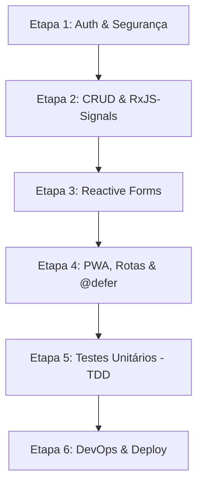

# 📋 Plano de Ação - Hidden Friend v2.0.0 (Atualizado)

Este documento descreve o plano de ação estruturado em etapas (com branches específicas do Gitflow) para cumprir todos os requisitos e Indicadores de Desempenho (IDs) solicitados.

---

## 🚦 Diretrizes de Entrega e Commits
Para garantir conformidade com as novas orientações de desenvolvimento e auditoria do projeto:
1. **Commit por ID:** Cada ID do checklist concluído deve gerar um commit isolado e descritivo no Git identificando o ID trabalhado (ex: `feat(auth): implement Supabase Auth session [ID21]`).
2. **Relatório Técnico ao Fim de Cada Etapa:** No final de cada etapa, será gerado um relatório de defesa técnica para cada ID abordado, respondendo obrigatoriamente a quatro perguntas:
    *   **1. O Conceito (Em palavras simples):** O que é esse recurso no Angular ou no BaaS?
    *   **2. A Motivação (Por que aqui?):** Por que esse recurso específico foi utilizado neste ponto do projeto?
    *   **3. A Anatomia do Código:** Onde está a sintaxe e explicação detalhada da linha de código.
    *   **4. O Teste do "E se eu tirar?":** O que quebra na segurança, na performance ou no fluxo de dados se removermos essa regra?

---

## 🗺️ Visão Geral das Etapas

---

## 📌 Detalhamento das Etapas

### 🔐 Etapa 1: Autenticação, Interceptors e Segurança
*   **Branch:** `feature/supabase-auth-guards`
*   **Escopo:**
    *   Configuração do cliente do Supabase no Angular (injetores e ambiente).
    *   **[ID21]** Fluxo de Autenticação e Gerenciamento de Sessão (JWT) com Supabase Auth.
    *   **[ID19]** Proteção de rotas do organizador utilizando *Functional Route Guards*.
    *   **[ID23]** Centralização de tokens JWT e tratamento global de erros em *Functional Interceptors*.
*   **Ação de Commit:** Um commit para cada ID (`[ID21]`, `[ID19]`, `[ID23]`).

### 🗄️ Etapa 2: CRUD com Supabase e Integração RxJS-Signals
*   **Branch:** `feature/supabase-crud-rxjs`
*   **Escopo:**
    *   **[ID22]** Ciclo CRUD completo das tabelas no Supabase Database (Events, Participants, Wishlist, Draws).
    *   **[ID25]** Ponte reativa e assíncrona usando `toSignal()` e `toObservable()`.
*   **Ação de Commit:** Um commit para cada ID (`[ID22]`, `[ID25]`).

### 📝 Etapa 3: Formulários Reativos com Validações Rigorosas
*   **Branch:** `feature/reactive-forms-validation`
*   **Escopo:**
    *   **[ID24]** Migração de formulários (Auth, Eventos, Lista de Desejos) para *Reactive Forms* com mensagens de erro dinâmicas e desativação condicional do botão de submit.
*   **Ação de Commit:** Commit correspondente ao `[ID24]`.

### 📱 Etapa 4: Experiência Mobile-First, PWA e Otimizações de Layout
*   **Branch:** `feature/pwa-performance-layout`
*   **Escopo:**
    *   **[ID3]** Configuração do PWA com `manifest.webmanifest`, ícones, temas e tela offline básica.
    *   **[ID17]** Navegação aninhada (rotas filhas) para estruturação das áreas da aplicação.
    *   **[ID8]** Carregamento de componentes sob demanda usando Deferrable Views (`@defer`).
*   **Ação de Commit:** Um commit para cada ID (`[ID3]`, `[ID17]`, `[ID8]`).

### 🧪 Etapa 5: Qualidade de Software e Testes de Regras de Negócio (TDD)
*   **Branch:** `feature/tdd-unit-tests`
*   **Escopo:**
    *   **[ID33]** Implementação de suítes de testes unitários (`.spec.ts`) validando as regras cruciais de negócio do `sdd.md`.
*   **Ação de Commit:** Commit correspondente ao `[ID33]`.

### 🚀 Etapa 6: DevOps, CI/CD e Publicação Contínua
*   **Branch:** `feature/devops-vercel-deploy`
*   **Escopo:**
    *   **[ID27]** Integração sem conflitos de branches no GitHub via Pull Requests.
    *   **[ID28]** Deploy contínuo automatizado do monorepo para a Vercel.
*   **Ação de Commit:** Um commit para cada ID (`[ID27]`, `[ID28]`).

---

## 🚦 Próximos Passos
1. Criar a branch `feature/supabase-auth-guards` a partir de `develop`.
2. Instalar a biblioteca cliente do Supabase no frontend.
3. Iniciar o desenvolvimento do **[ID21]**.
