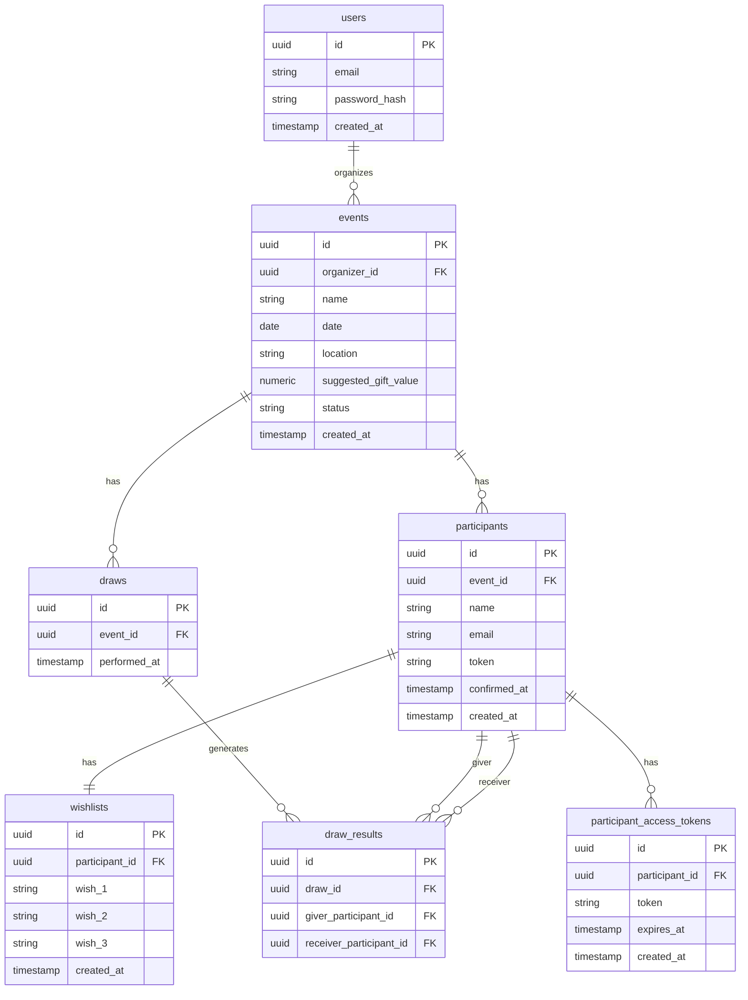

# 🛠️ Software Design Document (SDD)

**Projeto:** Hidden Friend  
**Versão:** 2.0.0  
**Status:** 🟢 Pronto para Implementação  

---

## 🏗️ 1. Arquitetura do Sistema (Monorepo)

O projeto segue arquitetura **Monorepo**, separando responsabilidades:

- **`docs/`** → Documentação oficial (PRD, SDD)
- **`apps/web/`** → Frontend Angular (Principal)
- **`apps/api/`** → Backend (Supabase / Edge Functions)

---

## 🤖 2. Orquestração e Contexto de IA (MCP)

> A IA DEVE consultar estes contextos antes de decisões estruturais

- **Figma MCP:** Fonte de design system
- **Supabase MCP:** Fonte da verdade do banco + RLS
- **GitHub MCP:** Fonte das User Stories e progresso

---

## 📦 3. Stack Tecnológica e Bibliotecas

### Core

- **Frontend:** Angular 20+ (Standalone + Signals obrigatório)
- **Backend:** Supabase (PostgreSQL + RLS)
- **Styling:** Tailwind CSS v4 (CSS-first)
- **UI:** Spartan UI (Headless)
- **Ícones:** Lucide Angular

### Regras obrigatórias

- ❌ Proibido NgModules
- ❌ Proibido CSS global não controlado
- ❌ Proibido estado global fora de Signals/Store

---

## 🎨 3.1 Decisão de UI

**Escolha:** Spartan UI

Motivos:
- Headless → controle total
- Mobile-first
- Baixo acoplamento
- Escalável para Design System próprio

---

## 🗄️ 4. Arquitetura de Dados

### 📖 4.1 Glossário Técnico

| Termo PRD (PT-BR)        | Entidade Técnica (EN - snake_case) | Atributos Principais                                                               |
| :----------------------- | :--------------------------------- | :--------------------------------------------------------------------------------- |
| Evento                   | `events`                           | `id`, `organizer_id`, `name`, `date`, `location`, `suggested_gift_value`, `status` |
| Organizador              | `users`                            | `id`, `email`, `password_hash`, `created_at`                                       |
| Participante             | `participants`                     | `id`, `event_id`, `name`, `email`, `token`, `confirmed_at`                         |
| Sorteio                  | `draws`                            | `id`, `event_id`, `performed_at`                                                   |
| Resultado do Sorteio     | `draw_results`                     | `id`, `draw_id`, `giver_participant_id`, `receiver_participant_id`                 |
| Amigo Secreto (Sorteado) | `draw_results`                     | `giver_participant_id`, `receiver_participant_id`                                  |
| Lista de Desejos         | `wishlists`                        | `id`, `participant_id`, `wish_1`, `wish_2`, `wish_3`, `created_at`                 |
| Link de Acesso           | `participant_access_tokens`        | `id`, `participant_id`, `token`, `expires_at`, `created_at`                        |

---

### 📊 4.2 Diagrama ER



---

## 📑 5. Contratos Globais

📁 `src/app/core/models/`

```ts
// user.model.ts
export interface User {
  id: string;
  email: string;
  password_hash: string;
  created_at: string;
}
```

```ts
// event.model.ts
export interface Event {
  id: string;
  organizer_id: string;
  name: string;
  date: string;
  location: string;
  suggested_gift_value: number;
  status: string;
  created_at: string;
}
```

```ts
// participant.model.ts
export interface Participant {
  id: string;
  event_id: string;
  name: string;
  email: string;
  token: string;
  confirmed_at: string | null;
  created_at: string;
}
```

```ts
// draw.model.ts
export interface Draw {
  id: string;
  event_id: string;
  performed_at: string;
}
```

```ts
// draw-result.model.ts
export interface DrawResult {
  id: string;
  draw_id: string;
  giver_participant_id: string;
  receiver_participant_id: string;
}
```

```ts
// wishlist.model.ts
export interface Wishlist {
  id: string;
  participant_id: string;
  wish_1: string;
  wish_2: string;
  wish_3: string;
  created_at: string;
}
```

```ts
// participant-access-token.model.ts
export interface ParticipantAccessToken {
  id: string;
  participant_id: string;
  token: string;
  expires_at: string;
  created_at: string;
}
```

---

## 🏗️ 6. Scaffolding

### 📂 Estrutura

```
src/app/
├── core/
├── shared/
├── features/
```

### 📦 Features

- auth
- events
- participants
- draw
- wishlist
- public

---

## 🛡️ 7. Segurança (RLS)

| Tabela                      | Política (RLS)                                                                                                                                                                                                                                        |
| :-------------------------- | :---------------------------------------------------------------------------------------------------------------------------------------------------------------------------------------------------------------------------------------------------- |
| `users`                     | **SELECT/UPDATE**: Apenas o próprio usuário (`auth.uid() = id`) <br> **INSERT**: Permitido via signup <br> **DELETE**: Apenas o próprio usuário                                                                                                       |
| `events`                    | **SELECT**: Apenas eventos do organizador (`auth.uid() = organizer_id`) <br> **INSERT**: Usuário autenticado <br> **UPDATE/DELETE**: Apenas o organizador (`auth.uid() = organizer_id`)                                                               |
| `participants`              | **SELECT**: Organizador do evento OU participante via token válido <br> **INSERT**: Organizador do evento <br> **UPDATE**: Organizador OU participante (para confirmação de identidade) <br> **DELETE**: Apenas organizador (antes do sorteio - RN05) |
| `draws`                     | **SELECT**: Apenas organizador do evento <br> **INSERT**: Apenas organizador ao executar sorteio <br> **UPDATE/DELETE**: ❌ Não permitido (imutável após criação - RN05)                                                                               |
| `draw_results`              | **SELECT**: Apenas o participante envolvido (`giver_participant_id` via token) OU organizador <br> **INSERT**: Sistema (via função segura no backend / RPC) <br> **UPDATE/DELETE**: ❌ Não permitido (RN03, RN05)                                      |
| `wishlists`                 | **SELECT**: Participante dono OU participante que o tirou <br> **INSERT**: Participante dono <br> **UPDATE**: Participante dono (antes da revelação - RN04) <br> **DELETE**: ❌ Não permitido                                                          |
| `participant_access_tokens` | **SELECT**: Sistema (validação de token) <br> **INSERT**: Organizador (ao criar participantes) <br> **UPDATE**: ❌ Não permitido <br> **DELETE**: Sistema (expiração/opcional cleanup)                    

---

<<<<<<< Updated upstream
## 🛡️ 7. Design Tokens (Variáveis CSS Base)
# Color Palette
Our color palette is designed to be clear and accessible in a **dark** interface.
 
*   **Primary Color:** `#6D28D9` (A vibrant purple, used for primary actions and key brand elements.)
*   **Secondary Color:** `#10B981` (A bright green, complementing the primary for secondary actions and highlights.)
*   **Neutral Color:** `#0F172A` (A very dark blue, serving as the base for backgrounds and text in dark mode.)
 
# Typography
Our typographic system utilizes the 'Inter' font family across all major text roles, ensuring consistency and readability.
 
*   **Headline Font:** Inter
*   **Body Font:** Inter
*   **Label Font:** Inter
 
# Shape and Form
The system adopts a moderate approach to corner rounding.
 
*   **Roundedness:** `Full` (Pill-shaped rounding, providing a friendly and modern aesthetic across all interactive elements.)
 
# Spacing
The layout density is set to a normal level, balancing information display with adequate whitespace.
 
*   **Spacing:** `2` (Normal spacing, providing a comfortable visual rhythm.)
=======
## 📡 8. API

- REST padrão
- plural resources
- responses consistentes

---

## ⚙️ 9. Environment

- supabaseUrl
- supabaseKey

---

## 🧩 10. Frontend

- Signals obrigatório
- Loading states obrigatórios

---

## 🧪 11. Testes

- Testar comportamento real
- Sem testes vazios

---

## 🎯 12. Regras de Negócio

- Min 3 participantes
- Sem auto-sorteio
- Sigilo garantido
- Sorteio imutável

---

## 🎨 13. Design Tokens

- Primary: #6D28D9
- Secondary: #10B981
- Background: #0F172A
- Font: Inter
>>>>>>> Stashed changes
